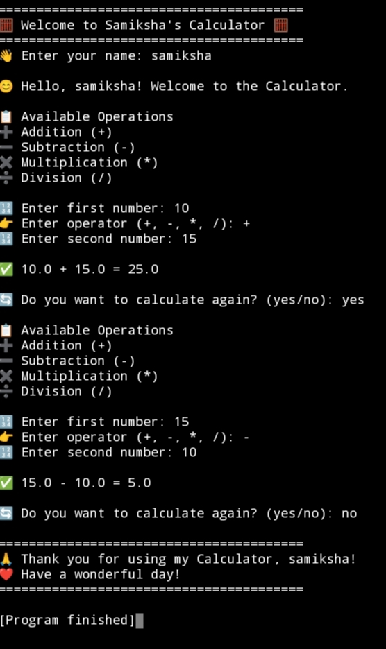

# Smart Python Calculator

A beginner-friendly calculator built with Python.

## Features
- Addition
- Subtraction
- Multiplication
- Division

## How to Run
1. Install Python.
2. Open the project.
3. Run the Python file.

## Screenshot

## Author
Samiksha Kolte

## 🚀 Future Improvements

- Add more mathematical operations
- Make the calculator faster
- Improve user experience
- Create a GUI version
